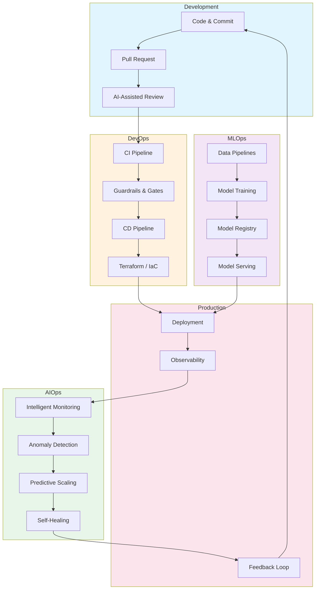

# 4KMetrics

## Accelerated, Data-Driven Software Delivery at Scale

Years of DevOps expertise meets modern GenAI tooling. We partner with your developers and leadership to transform how you ship software.

---

## What We Do

We don't just hand you tools—we work alongside your team to understand your codebase, assess your current delivery process, and build a roadmap for measurable improvement.

**Our Process:**

1. **Assess** — Analyze your code, pipelines, and delivery workflow using GenAI-powered insights
2. **Align** — Collaborate with developers and org leaders to understand goals and constraints
3. **Architect** — Design a tailored plan using industry-proven patterns and existing tools
4. **Accelerate** — Implement changes that drive data-driven deployment velocity improvements

---

## The 4 Key Metrics We Optimize

| Metric | Target | Status |
|--------|--------|--------|
| **Deployment Frequency** | On-Demand | Daily |
| **Lead Time for Changes** | < 1 Hour | Automated |
| **Change Failure Rate** | < 5% | Monitored |
| **Time to Restore** | < 30 Mins | SLA Driven |

*Based on DORA research — the metrics that separate elite performers from the rest.*

---

## How We Bring It All Together

---

## What We Deliver

| Capability | Description |
|------------|-------------|
| **CI/CD Pipelines** | GitHub Actions, GitLab CI, or your preferred platform |
| **Infrastructure** | AWS, GCP, Azure — Terraform modules ready to go |
| **Observability** | Prometheus, Grafana, OpenTelemetry stacks |
| **Security** | SAST, DAST, dependency scanning baked in |
| **ML Pipelines** | From data ingestion to model deployment |

---

## Why 4KMetrics

| What You Get | How We Deliver |
|--------------|----------------|
| **Experience** | Years of hands-on DevOps across startups and enterprises |
| **Intelligence** | GenAI tools to analyze code and identify bottlenecks |
| **Pragmatism** | We use proven, community-maintained tools—not custom bloat |
| **Partnership** | We work *with* your team, not around them |

We leverage what works: Terraform Registry modules, open source observability (Prometheus, Grafana, OpenTelemetry), and battle-tested CI/CD patterns. Why build from scratch when you can build on giants?

---

**Ship Fast. Ship Safe. Ship Often.**
