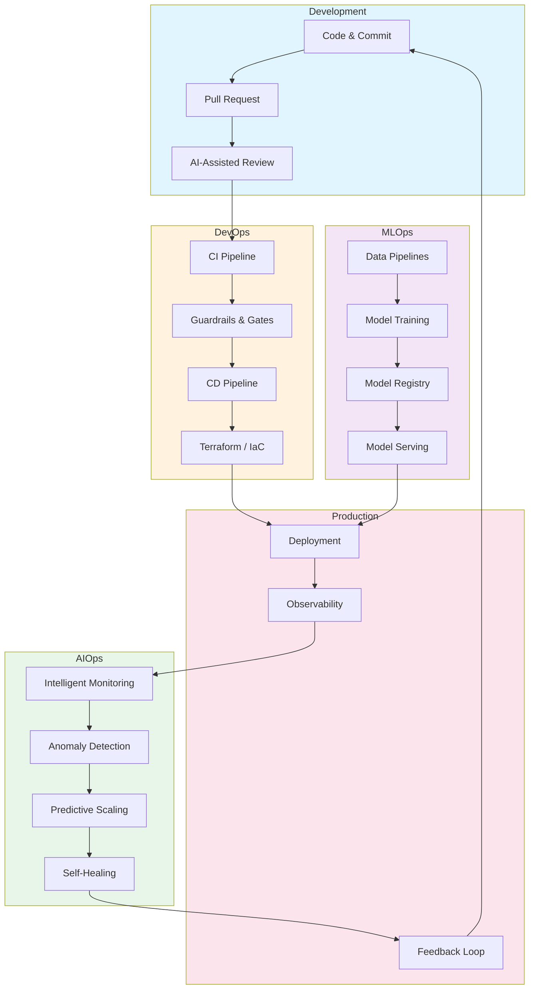
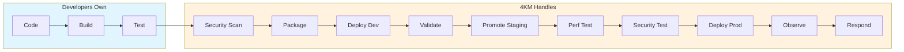

# 4KM

## Accelerated, Data-Driven Software Delivery at Scale

Years of DevOps expertise meets modern GenAI tooling. We partner with AI-augmented engineering teams to transform how you ship software—so your developers solve problems only humans can solve.

---

## What We Do

We don't just hand you tools—we work alongside your team to understand your codebase, assess your current delivery process, and build a roadmap for measurable improvement.

**Our Process:**

1. **Assess** — Analyze your code, pipelines, and delivery workflow using GenAI-powered insights
2. **Align** — Collaborate with developers and org leaders to understand goals and constraints
3. **Architect** — Design a tailored plan using industry-proven patterns and existing tools
4. **Accelerate** — Implement changes that drive data-driven deployment velocity improvements

---

## Why Now

AI is automating the repetitive. The teams that win are the ones who redirect their engineers toward work that requires judgment, context, and relationships—things no model can replicate.

- **Your developers + AI** → Architecture decisions, edge cases, customer context, novel problems
- **4KM** → Pipelines, security gates, infrastructure, observability, incident response

We don't build models. We implement them into reliable workflows your business can depend on.

---

## The 4 Key Metrics We Optimize

| Metric | Target | Status |
|--------|--------|--------|
| **Deployment Frequency** | On-Demand | Daily |
| **Lead Time for Changes** | < 1 Hour | Automated |
| **Change Failure Rate** | < 5% | Monitored |
| **Time to Restore** | < 30 Mins | SLA Driven |

*Based on DORA research — the metrics that separate elite performers from the rest.*

---

## How We Bring It All Together

---

## What We Deliver

| Capability | Description |
|------------|-------------|
| **CI/CD Pipelines** | GitHub Actions, GitLab CI, or your preferred platform |
| **Infrastructure** | AWS, GCP, Azure — Terraform modules ready to go |
| **Observability** | Prometheus, Grafana, OpenTelemetry stacks |
| **Security** | SAST, DAST, dependency scanning baked in |
| **ML Pipelines** | From data ingestion to model deployment |

---

## Software Delivery Lifecycle

Your engineers + AI should own what requires judgment. We automate what doesn't.

| Phase | What Happens | What 4KM Provides |
|-------|--------------|-------------------|
| **Code** | Write code, GenAI-assisted | PR workflows, branch policies, review automation |
| **Build** | Compile, bundle, artifacts | CI pipelines, dependency caching, build optimization |
| **Test** | Unit, integration, E2E | Test automation, parallel runners, test environments |
| **Security Scan** | SAST, SCA, secret detection | Security gates, vulnerability policies, compliance |
| **Package** | Container images, artifacts | Container registries, image signing, versioning |
| **Deploy Dev** | Push to dev environment | Terraform, Kubernetes, Helm, ArgoCD |
| **Validate** | Smoke tests, integration checks | Automated validation gates, synthetic monitoring |
| **Promote Staging** | Environment promotion | Promotion pipelines, config management |
| **Perf Test** | Load and stress testing | Performance gates, baseline comparisons |
| **Security Test** | DAST, runtime scanning | Penetration automation, compliance checks |
| **Deploy Prod** | Production release | Blue/green, canary, rollback strategies |
| **Observe** | Monitoring, logging, tracing | Prometheus, Grafana, OpenTelemetry, alerting |
| **Respond** | Incidents, scaling | Runbooks, auto-scaling, self-healing |

---

## Why 4KM

| What You Get | How We Deliver |
|--------------|----------------|
| **Domain Depth** | Years of hands-on DevOps—not generic playbooks from a textbook |
| **Partnership** | We embed *with* your team, building trust and context over time |
| **Durability** | Battle-tested patterns that survive platform shifts and hype cycles |
| **Speed** | 2-week delivery cycles—we ship, learn, and iterate |
| **Pragmatism** | Proven, community-maintained tools—not custom bloat |

We leverage what works: Terraform Registry modules, open source observability (Prometheus, Grafana, OpenTelemetry), and patterns that have survived production. Why build from scratch when you can build on giants?

---

**Ship Fast. Ship Safe. Ship Often.**
