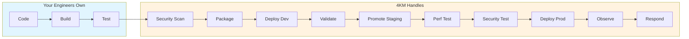
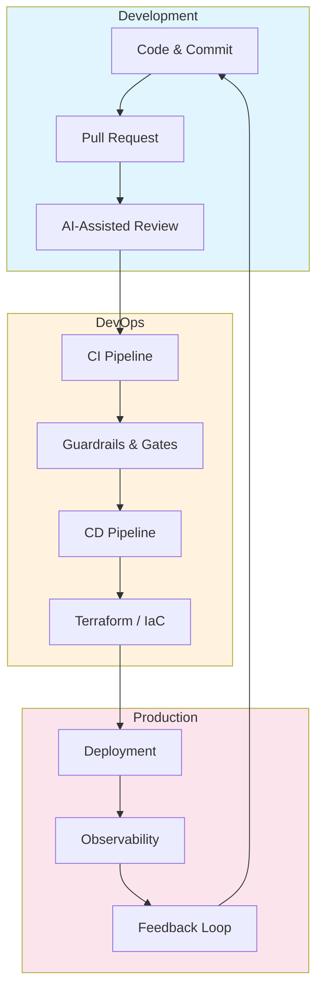

# 4KM

## Fix how you ship!

AI-powered insights to measure, diagnose, and fix your software delivery pipeline.

---

## How We Work

We embed with your team — assess your current delivery process, find the bottleneck, and fix it. No generic playbooks. Real infrastructure work, measured by the metrics that matter.

**Measure** → Baseline your DORA metrics to see where you actually stand

**Diagnose** → Pinpoint what's slowing you down — CI? Environments? Config drift? Release process?

**Fix** → Implement the infrastructure changes with your team

**Prove** → Show the before/after with hard numbers

---

## The 4 Key Metrics

| Metric | What It Tells You | Elite Target |
|--------|-------------------|--------------|
| **Deployment Frequency** | How often you ship | On-demand |
| **Lead Time for Changes** | Commit to production | < 1 hour |
| **Change Failure Rate** | How often deploys break things | < 5% |
| **Time to Restore** | How fast you recover | < 30 min |

*Based on DORA research — the metrics that separate elite performers from everyone else.*

---

## What We Deliver

Your engineers focus on code, architecture, and the problems only humans can solve. We handle everything between commit and production — and everything after.

| Capability | What You Get |
|------------|--------------|
| **CI/CD Pipelines** | GitHub Actions, GitLab CI — fast, reliable, maintained |
| **Infrastructure** | Terraform modules for AWS, GCP, Azure |
| **Kubernetes** | Production-grade clusters, RBAC, autoscaling, security |
| **Observability** | Prometheus, Grafana, OpenTelemetry — see everything |
| **Security** | SAST, DAST, dependency scanning baked into the pipeline |
| **ML Deployment** | SageMaker endpoints, inference pipelines |

---

## The Full Pipeline

---

## Why 4KM

| | |
|---|---|
| **Domain depth** | Years of hands-on DevOps — not generic consulting from a textbook |
| **Partnership** | We embed with your team, building trust and context over time |
| **Speed** | 2-week delivery cycles — ship, measure, iterate |
| **Durability** | Battle-tested patterns that survive platform shifts and hype cycles |
| **Pragmatism** | Open-source tools and community modules — no custom bloat |